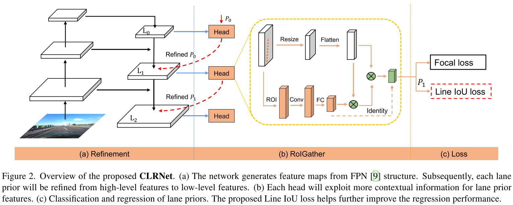

# CLRNet: Cross Layer Refinement Network for Lane Detection
## Introduction
Code for the [CLRNet paper](https://arxiv.org/abs/2203.10350), accepted to CVPR 2022.

## Installation
### Create a conda virtual environment and activate it (conda is optional)
```Shell
conda create -n clrnet python=3.8
conda activate clrnet
```
### Install dependencies
```Shell
# Install python packages
pip install -r requirements.txt
```
## Training
```Shell
python main.py configs/resnet34_tusimple.py --gpus 0
```